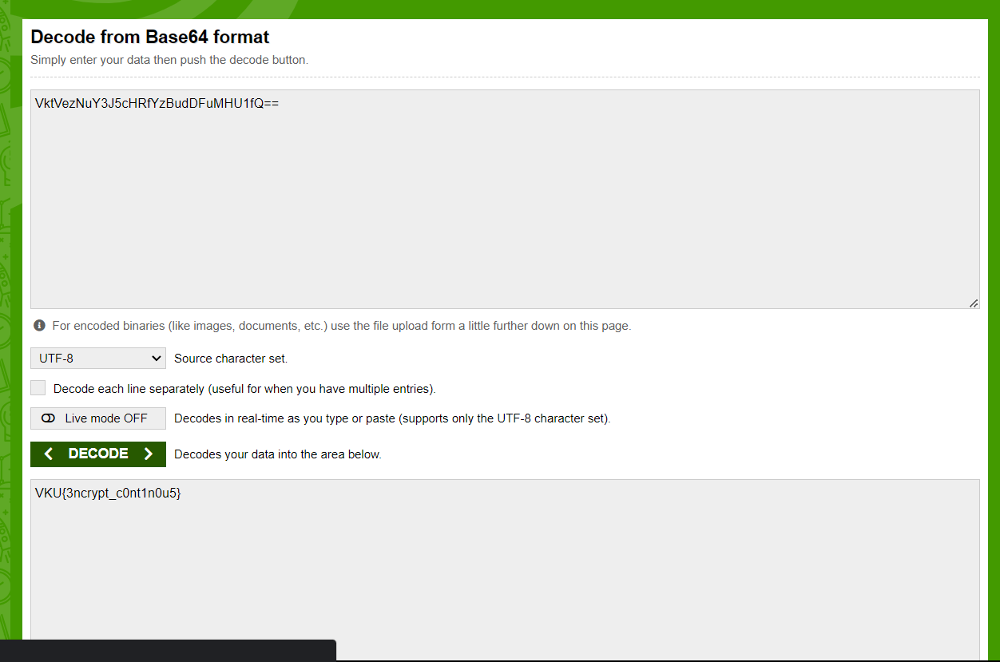

# Solve __encrypt_continous__

1. Đầu tiên, giải mã Hex
    Có thể dùng tool online sau: <https://www.convertstring.com/vi/EncodeDecode/HexDecode>

    

    - Giải mã nó được một chuỗi mã hóa base64

2. Giải mã base64:
    Dùng công cụ sau để giải mã base64
    <https://www.base64decode.org/>

    
    - Giải mã thu được mã Morse
3. Giải mã Morse
    Dùng trang web sau để giải mã mã Morse
    <https://morsedecoder.com/>

    
    - Giải mã thu được mã nhị phân
4. Giải mã nhị phân
    Dùng trang web sau để giải mã nhị phân
    <https://www.rapidtables.com/convert/number/binary-to-ascii.html>

    
    - Giải mã nó được một chuỗi mã hóa base64
5. Giải mã base64:
    Dùng công cụ sau để giải mã base64
    <https://www.base64decode.org/>

    
    - Giải mã thu được flag là: `VKU{3ncrypt_c0nt1n0u5}`
