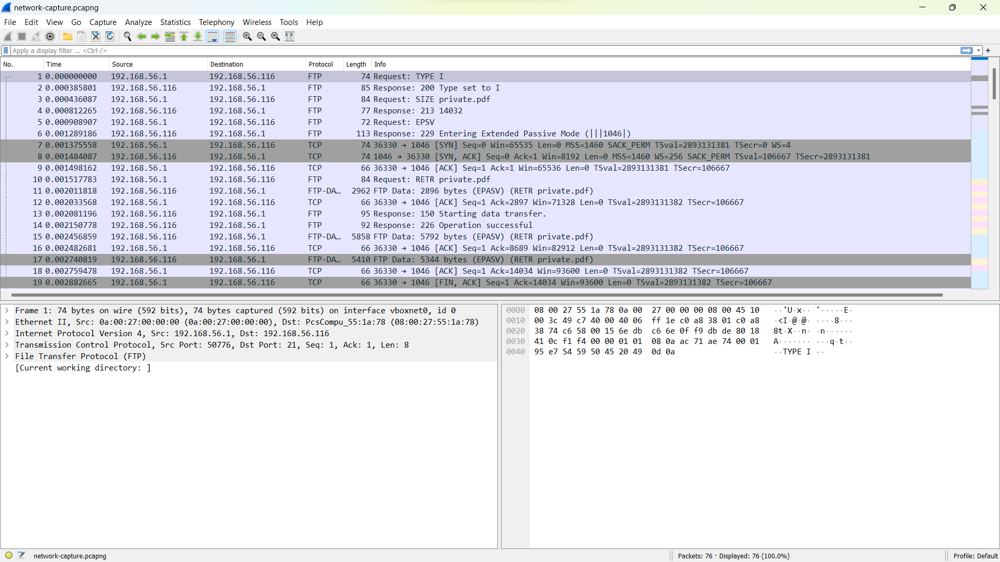
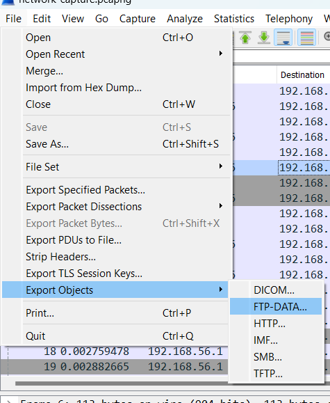
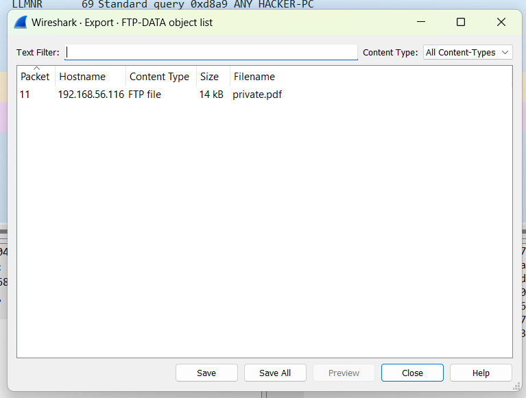
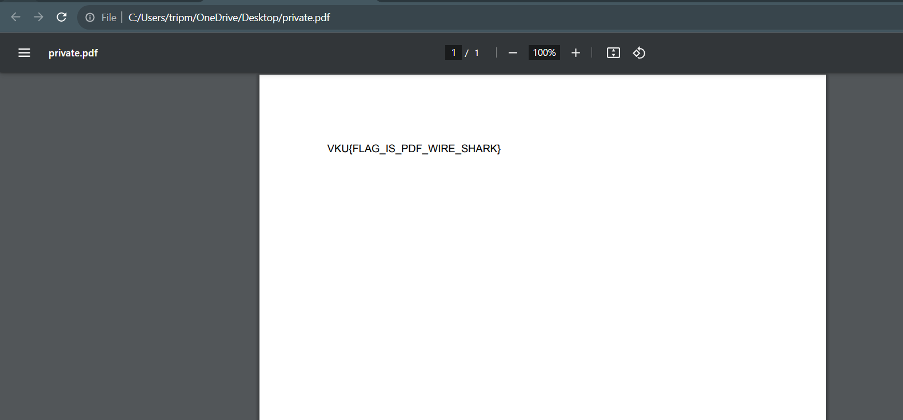

# Solve **Baby shark do do doooo**

- Tải công cụ Wireshark - Đây là công cụ dùng để phân tích các gói tin.
- Mở file thử thách lên bằng Wireshark

Dùng tính năng Export Object: **File -> Export Object -> FTP-DATA**

Có một file là **private.pdf**

Chọn file này và bấm Save để lưu file. Sau đó mở file lên sẽ thấy được flag

`Flag: VKU{FLAG_IS_PDF_WIRE_SHARK}`
