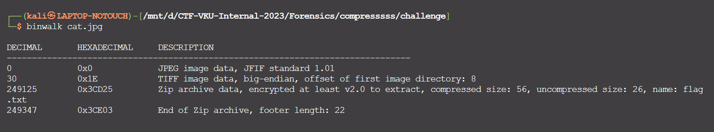
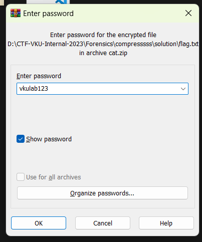
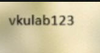

# Solve **Compresssss**

Dùng công cụ Binwalk thì phát hiện được file ảnh này có chứa một file zip

Đổi đuôi file thành zip và tiến hành giải nén

Pass giải nén được hiển thị ở trong tấm ảnh

Giải nén ra sẽ có file flag.txt.
Đọc nội dung file flag.txt sẽ lấy được flag.

`Flag: VKU{1s_1t_r34lly_a_ph0t0?}`
