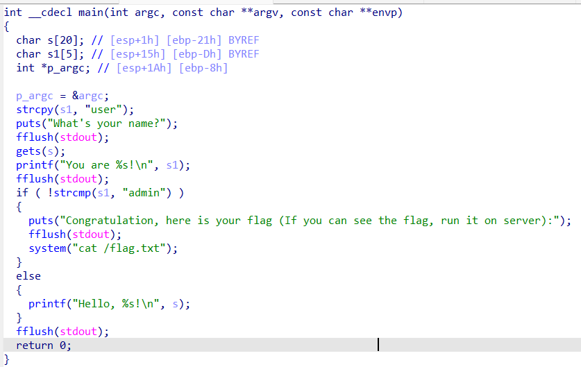
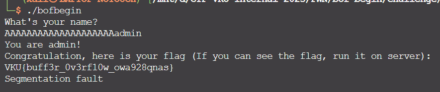

# Solve **BOF Begin**

Dùng IDA để phân tích mã nguồn của chương trình.

- Theo logic chương trình thì để lấy được **flag** thì biến `s1` phải có giá trị là `"admin"`.
- Ở đây, biến `s1` được khai báo, được gán giá trị là `"user"`. Tuy nhiên, theo đoạn code thì không có cách nào để thay đổi giá trị của biến `s1`.

- Mảng ký tự `s` được khai báo với 20 phần tử.

=> **Câu hỏi đặt ra**: Sẽ ra sao nếu truyền nhiều hơn 20 ký tự vào biến s? Những ký tự bị thừa ra sẽ đi về đâu?

- Với bài này, mình đã setup để việc tràn bộ đệm có thể xảy ra. Chúng ta sẽ tận dụng lỗi **Buffer Overflow** để thay đổi giá trị của biến `s1` thành `"admin"`
- Chỉ cần chúng ta truyền vào 20 ký tự bất kỳ để lấp đầy biến **s**, sau đó thêm vào chuỗi `"admin"` thì biến `s1` sẽ bị ghi đè bởi chuỗi `"admin"` bị thừa ra này. Lúc này đã thỏa mãn điều kiện để lấy được flag.

- Payload để chương trình trả về flag là: `AAAAAAAAAAAAAAAAAAAAadmin`

`Flag: VKU{buff3r_0v3rf10w_owa928qnas}`
