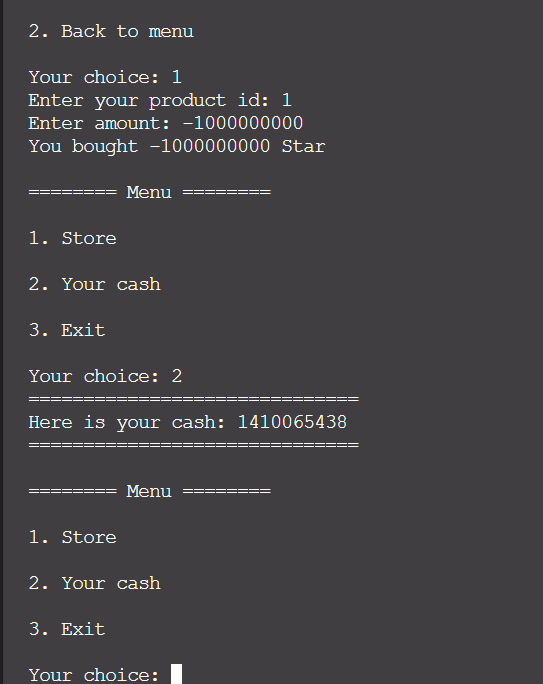
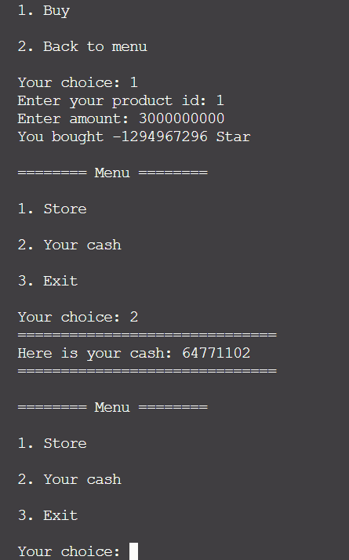
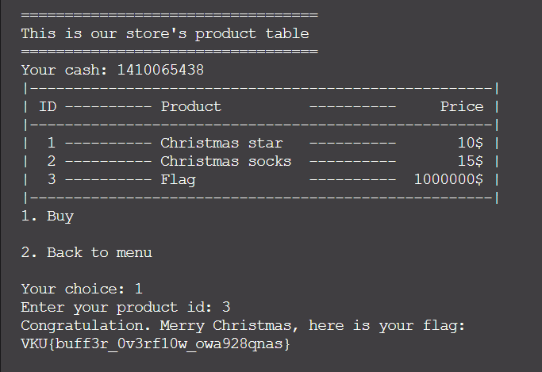

# Solve **Christmas Store**

Dùng IDA để phân tích mã nguồn.
Ở đây bạn có thể xem mã nguồn gốc của nó để tiết kiệm thời gian [Source.c](./../challenge/src/source.c)

Vậy để lấy được flag thì chúng ta phải tìm cách có 1 triệu $ để mua nó trong cửa hàng. Nhưng làm sao để kiếm được 1 củ $ này?

Admin said: Đây tiền đây, lấy mà mua =)))

---

Đùa thôi 😁, để kiếm được 1 triệu dollar này thì bạn hãy chú ý đến bước mua các món đồ khác trong cửa hàng. Sau khi chọn một ID món đồ, chương trình sẽ yêu cầu bạn nhập số lượng muốn mua. Ở đây, sẽ có 2 hướng khai thác:

**1. Truyền vào số âm:**

- Nếu bạn truyền vào một số âm vừa đủ thì bạn có thể lấy được 1 triệu dollar dễ dàng. Bởi vì công thức tính tiền của chương trình là:

`tiền trong ví của bạn = tiền trong ví - (giá trị món đồ) * số lượng`

- Vì số lượng bị âm nên phép trừ kia sẽ thành phép cộng

**2. Tận dụng lỗi tràn số nguyên:**

- Nếu bạn truyền một số lớn hơn giá trị của kiểu INT thì nó sẽ bị tràn và trả về giá trị giới hạn dưới của nó.
(Ví dụ: nếu truyền vào 2147483648 thì chương trình sẽ hiểu nó thành -2147483648)
- Lúc này bạn chỉ cần truyền vào một số đủ lớn để lấy được số tiền cần dung.

=> Bây giờ đã có đủ tiền, bạn chỉ cần mua flag và lấy nó thôi 😁

`Flag: VKU{buff3r_0v3rf10w_owa928qnas}`
