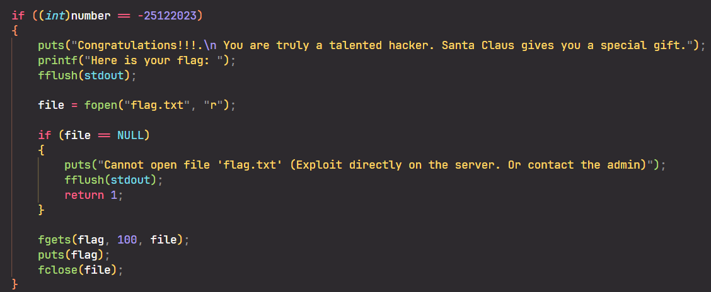
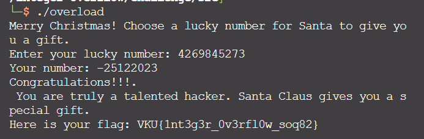

# Solve **Integer Overflow**

Dùng IDA để phân tích mã nguồn. Ở đây bạn có thể xem mã nguồn trực tiếp [source.c](./../challenge/src/source.c)

Chương trình này yêu cầu bạn nhập một con số sao cho nó bằng với -25122023.
Tuy nhiên chương trình lại không cho nhập số âm. Vậy phải làm sao?

---
Để giải quyết điều này, bạn phải tận dụng lỗi tràn số nguyên.
Bạn chỉ cần truyền một số đủ lớn sao cho vượt quá giới hạn của kiểu INT và trở về giới hạn dưới của nó đến khi đạt giá trị -25122023.

`Giới hạn của INT là: -2147483648 đến 2147483647`

Làm một số tính toán đơn giản: `2147483647 + ((-25122023)-(-2147483648)) + 1 = 4269845273`

Vậy số tối thiểu cần nhập để giải bài này là: `4269845273`

(Ngoài ra còn rất nhiều số khác: 8564812569, 12859779865, ...)

`Flag: VKU{1nt3g3r_0v3rfl0w_soq82}`
