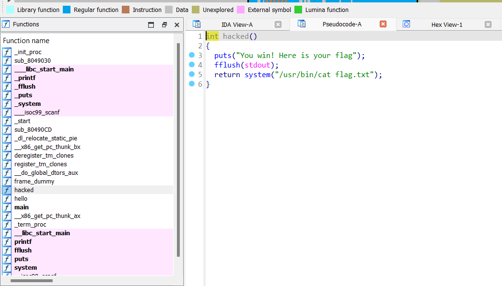
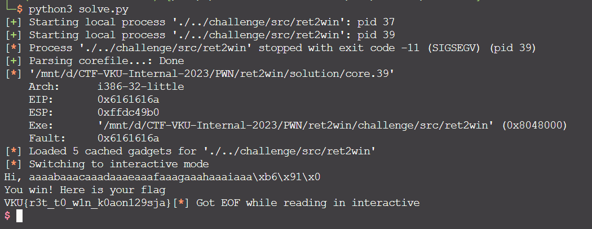

# Solve **Ret 2 Win**

Dùng IDA để phân tích mã nguồn
Bạn có thể xem mã nguồn gốc của thử thách tại đây: [source.c](../challenge/src/source.c)

---
Phân tích mã nguồn, có một hàm là hàm `**hacked**` được dùng để đọc flag. Tuy nhiên hàm này lại không được gọi tới để sử dụng

Để khai thác bài này, chúng ta phải khai thác lỗi Buffer Overflow để ghi đè địa chỉ trả về của hàm main bằng địa chỉ của hàm `**hacked**`.

Mình đã viết một mã python để khai thác tự động thử thách này.
Xem và tải nó tại đây: [solve.py](./solve.py)

Cách payload này hoạt động và cách giải tay mình sẽ hướng dẫn trong những buổi training tiếp theo.

`FLAG: VKU{r3t_t0_w1n_k0aon129sja}`
