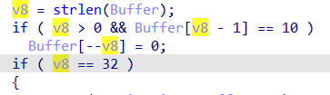
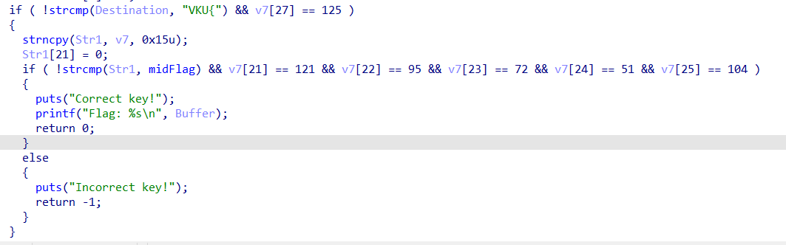
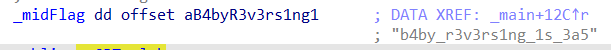
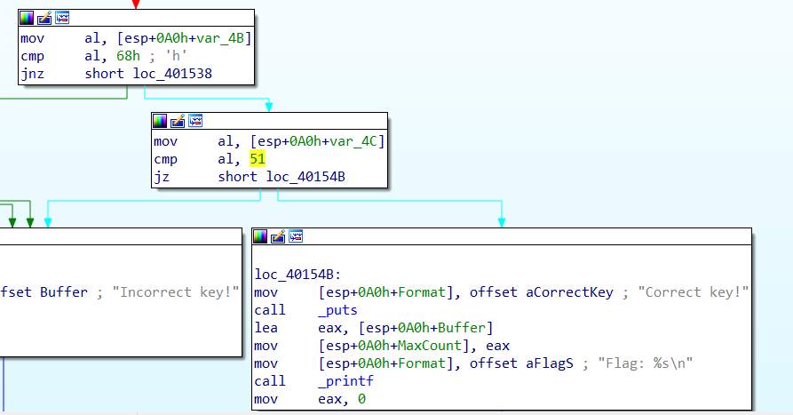

# Solve **Baby Rev 2**

Dùng IDA để phân tích mã nguồn của nó.
Bạn có thể xem mã nguồn của nó ở đây [babyRev2.c](../challenge/dist/babyRev2.c)

Ở đây, nhiệm vụ của bạn là nhập một chuỗi ký tự sao cho nó phải đúng với flag.
Trong chương trình này, flag đã bị chia thành nhiều phần nhỏ. Gộp nó lại bạn sẽ lấy được flag.

---

- Đầu tiên, input phải có độ dài 32 ký tự.



- Tiếp theo, copy 4 giá trị đầu của **input** vào biến **Destination**. Sau đó, so sánh nó với chuỗi "VKU{". Điều này tương đương với **input** phải có 4 ký tự đầu là `**VKU{**`, ký tự cuối có mã ASCII là **125** (125 tương đương với ký tự `}`)



```c
strncpy(Destination, Buffer, 4u);
Destination[4] = 0;
if ( !strcmp(Destination, "VKU{") && v7[27] == 125 )
{
    strncpy(Str1, v7, 0x15u);
    Str1[21] = 0;
    if ( !strcmp(Str1, midFlag) && v7[21] == 121 && v7[22] == 95 && v7[23] == 72 && v7[24] == 51 && v7[25] == 104 )
    {
    puts("Correct key!");
    printf("Flag: %s\n", Buffer);
    return 0;
    }
    else
    {
    puts("Incorrect key!");
    return -1;
    }
}
```

- Tiếp theo, chương trình lại copy 15 ký tự của input vào biến Str1. Sau đó so sánh nó với giá trị của biến midFlag có giá trị `**b4by_r3v3rs1ng_1s_3a5**`

- Sau đó, so sánh lần lượt các ký tự tiếp theo với các mã ASCII.
   - 121 = "y"
   - 95 = "_"
   - 72 = "H"
   - 51 = "3"
   - 104 = "h"
- Ở đây, IDA khi biên dịch sang mã giả C bị thiếu một phần. Đọc ở dạng mã máy sẽ thấy đoạn mã sau

So sánh ký tự kế cuối của input với giá trị ASCII 51 = "3".
- Lúc này, gộp các phần lại với nhau ta sẽ có được flag hoàn chỉnh: VKU{b4by_r3v3rs1ng_1s_3a5y_H3h3}

`Flag: VKU{b4by_r3v3rs1ng_1s_3a5y_H3h3}`
