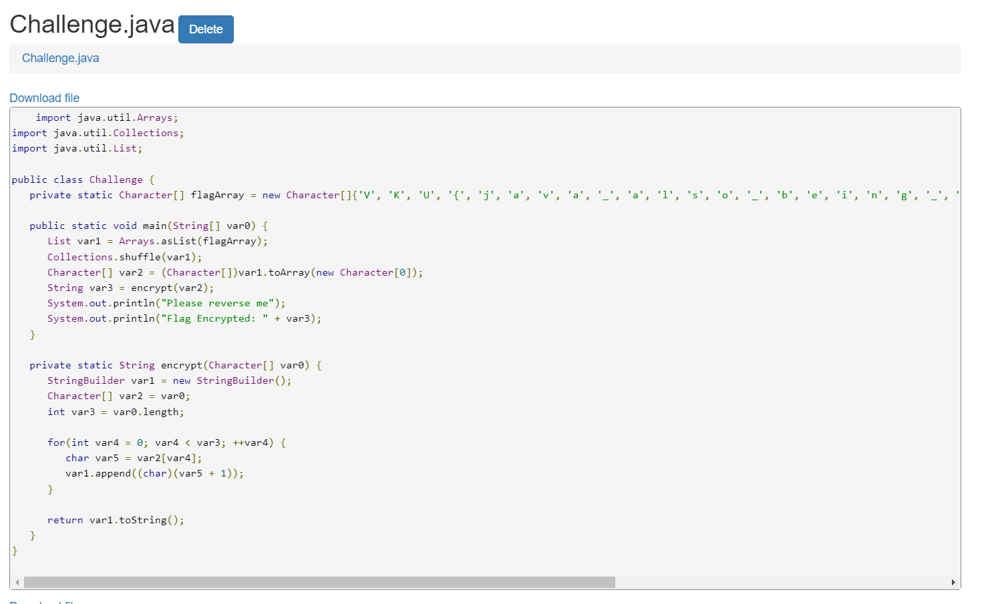

# Solve **Baby Rev 3**

File class là file được biên dịch từ Java

Với bài này, có thể sử dụng các công cụ để dịch ngược file class trở thành file java như: JD-GUI, JADX.
Ở bài này, sử dụng tool online sau để đơn giản hóa:

<https://www.decompiler.com/>

Upload file lên và tiến hành Decompile thì thu được mã nguồn ban đầu của nó bằng Java

Ở đoạn code này, có một mảng là flag. Mảng này chính là flag.

`Flag: VKU{java_also_being_used_in_reversing}`
