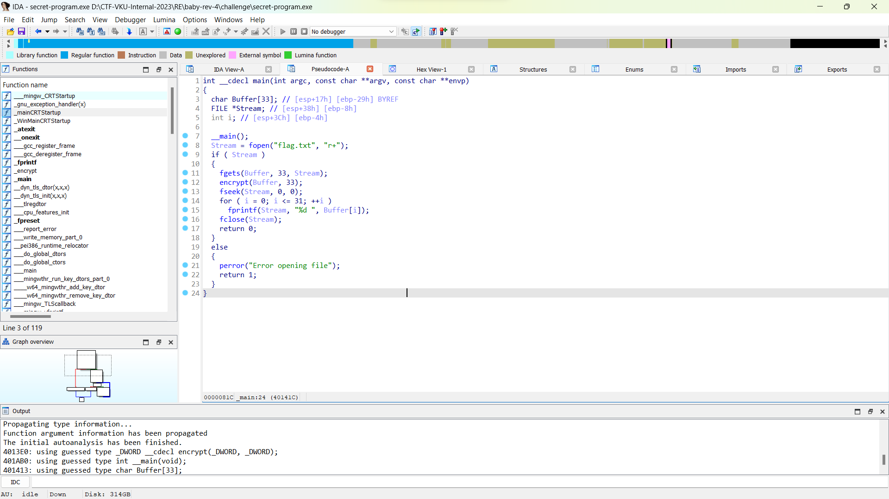
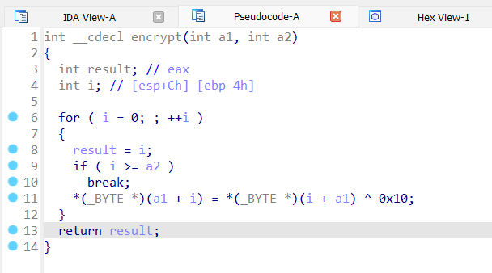
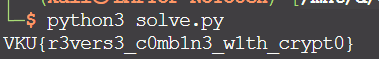

# Solve **Baby Rev 4**

Dùng IDA để phân tích mã nguồn của chương trình.
Bạn có thể xem mã nguồn gốc của chương trình ở đây: [source](../dist/source.c)

---
Khi dùng IDA để phân tích mã nguồn thì hàm main sẽ như sau:



```c
int __cdecl main(int argc, const char **argv, const char **envp)
{
  char Buffer[33]; // [esp+17h] [ebp-29h] BYREF
  FILE *Stream; // [esp+38h] [ebp-8h]
  int i; // [esp+3Ch] [ebp-4h]

  __main();
  Stream = fopen("flag.txt", "r+");
  if ( Stream )
  {
    fgets(Buffer, 33, Stream);
    encrypt(Buffer, 33);
    fseek(Stream, 0, 0);
    for ( i = 0; i <= 31; ++i )
      fprintf(Stream, "%d ", Buffer[i]);
    fclose(Stream);
    return 0;
  }
  else
  {
    perror("Error opening file");
    return 1;
  }
}
```

Chương trình sẽ lấy nội dung của file flag.txt sau đó mã hóa nó đi bằng hàm encrypt. Sau đó lại ghi nội dung đã mã hóa vào lại file flag.txt

Tiếp theo, phân tích mã nguồn của hàm encrypt thì sẽ được như sau:


```c
int __cdecl encrypt(int a1, int a2)
{
  int result; // eax
  int i; // [esp+Ch] [ebp-4h]

  for ( i = 0; ; ++i )
  {
    result = i;
    if ( i >= a2 )
      break;
    *(_BYTE *)(a1 + i) = *(_BYTE *)(i + a1) ^ 0x10;
  }
  return result;
}
```

Vậy cách thức mã hóa sẽ là xor từng ký tự trong file flag.txt với giá trị 0x10.

Tính chất của xor: A ^ B = C thì A = B ^ C

Để giải mã flag.txt, mình đã viết một đoạn code python [solve.py](./solve.py)

```python
# Convert encrypted flag to array of hex values
encryptFlag = "70 91 69 107 98 35 102 117 98 99 35 79 115 32 125 114 33 126 35 79 103 33 100 120 79 115 98 105 96 100 32 109".split(" ")

flag = ""

for i in encryptFlag:
    flag += chr(int(i) ^ 0x10)

print(flag)
```

Chạy đoạn mã này và sẽ lấy lại nội dung ban đầu của file flag.txt:


`Flag: VKU{r3vers3_c0mb1n3_w1th_crypt0}`
