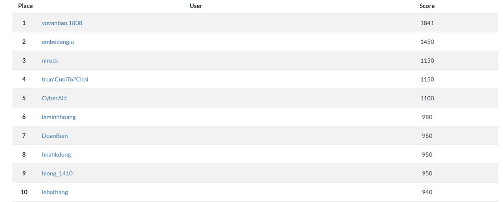

# CTF VKU Internal 2023

# ![Banner][Banner]

This repository contains official **source code** and **writeups** for the majority of challenges in VKU Internal CTF Contest 2023.

---

## 👑 SCOREBOARD 👑

- 👑 Champion: **vovanbao.1808**
- 🥇: **embedangiu**
- 🥈: **nirock**
- 🥉: **trumCuoiToi'Choi**

## Cryptography

| Name                                                       | Author           | Difficulty | Solves |
| ---------------------------------------------------------- | ---------------- | ---------- | ------ |
| [Base64](Cryptography/base64/)                             | mrb1n            | Easy (1)   | 19     |
| [Caesar](Cryptography/caesar/)                             | mrb1n            | Easy (1)   | 17     |
| [Encrypt Continous](Cryptography/encrypt_continuous/)      | mrb1n            | Easy (1)   | 8      |
| [Hash](Cryptography/hash/)                                 | mrb1n            | Easy (1)   | 12     |
| [RSA](Cryptography/RSA/)                                   | mrb1n            | Normal (2) | 8      |

## Forensics

| Name                                                          | Author           | Difficulty | Solves |
| ------------------------------------------------------------- | ---------------- | ---------- | ------ |
| [Baby shark do do doooo](Forensics/baby_shark_do_do_doooooo/) | lqlong           | Easy (1)   | 6      |
| [Compressssss](Forensics/compresssss/)                        | mrb1n            | Easy (1)   | 6      |
| [Find me](Forensics/find_me/)                                 | mrb1n            | Easy (1)   | 16     |
| [OSINT](Forensics/osint/)                                     | mrb1n            | Normal (2) | 11     |

## Binary Exploitation

| Name                                                       | Author           | Difficulty | Solves |
| ---------------------------------------------------------- | ---------------- | ---------- | ------ |
| [BOF Begin](PWN/bof-begin/)                                | mrb1n            | Easy (1)   | 4      |
| [Christmas Store](PWN/christmas-store/)                    | mrb1n            | Easy (1)   | 3      |
| [Integer Overflow](PWN/integer-overflow/)                  | mrb1n            | Easy (1)   | 4      |
| [Ret to win](PWN/ret2win/)                                 | mrb1n            | Normal (2) | 0      |

## Reverse Engineer

| Name                                                       | Author           | Difficulty | Solves |
| ---------------------------------------------------------- | ---------------- | ---------- | ------ |
| [Baby Rev 1](RE/baby-rev-1/)                               | mrb1n            | Easy (1)   | 25     |
| [Baby Rev 2](RE/baby-rev-2/)                               | mrb1n            | Easy (1)   | 5      |
| [Baby Rev 3](RE/baby-rev-3/)                               | mrb1n            | Easy (1)   | 13     |
| [Baby Rev 4](RE/baby-rev-4/)                               | mrb1n            | Easy (1)   | 2      |

## Web

| Name                                                       | Author           | Difficulty | Solves |
| ---------------------------------------------------------- | ---------------- | ---------- | ------ |
| [Find me](Web/FIND_ME/)                                    | lqlong           | Easy (1)   | 2      |
| [SQLI Level 1](Web/SQLI_LEVEL_1/)                          | lqlong           | Easy (1)   | 11     |
| [SQLI Level 2](Web/SQLI_LEVEL_2/)                          | lqlong           | Easy (1)   | 3      |
| [SQLI Level 3](Web/SQLI_LEVEL_3/)                          | lqlong           | Normal (2) | 0      |

---

## Conclusion

This is the first time we have organized and written CTF challenges ourselves. If there are any mistakes, please forgive them.

In the challenges, we use a number of place names and names of individual organizations to serve the competition. If there is anything that affects your individual or organization, please email us (<vkuctf@gmail.com>). Thank you!
Thank you to everyone who wrote the challenge. And we would also like to thank those who checked the challenges for us 🥰

[Banner]: https://files.catbox.moe/vw1zzo.png
