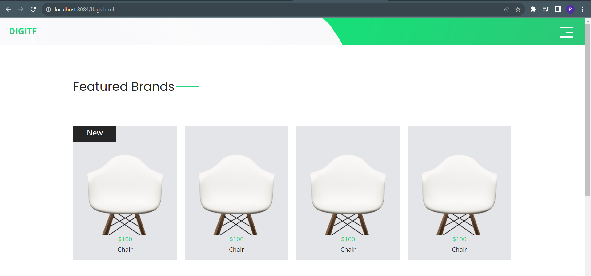
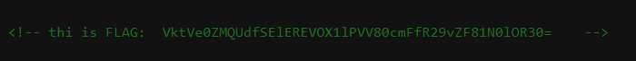

# Solve **Find Me**

Để giải bài này, bạn cần phải dùng các công cụ scan đường dẫn web. (gobuster, ffuf, dirb, dirsearch, ...)
Ở đây, sẽ sử dụng **ffuf**

Cài đặt FFUF ở đường dẫn sau: [FFUF Github](https://github.com/ffuf/ffuf)

Dùng lệnh như sau: `ffuf -u <url trang web> -w <đường dẫn tới file wordlist>`

Lệnh để tìm thực tế:

```bash
ffuf -u http://192.168.0.12:8084/FUZZ.html -w ./wordlist
```

Chạy lệnh trên sẽ dò được file **flags.html**



Truy cập vào file này, xem source code HTML của nó bằng **CRTL + U**
Trong web này sẽ có một mã base64. Giải mã nó sẽ lấy được flag


`VktVe0ZMQUdfSElEREVOX1lPVV80cmFfR29vZF81N0lOR30=`

`FLAG: VKU{FLAG_HIDDEN_YOU_4ra_Good_57ING}`
