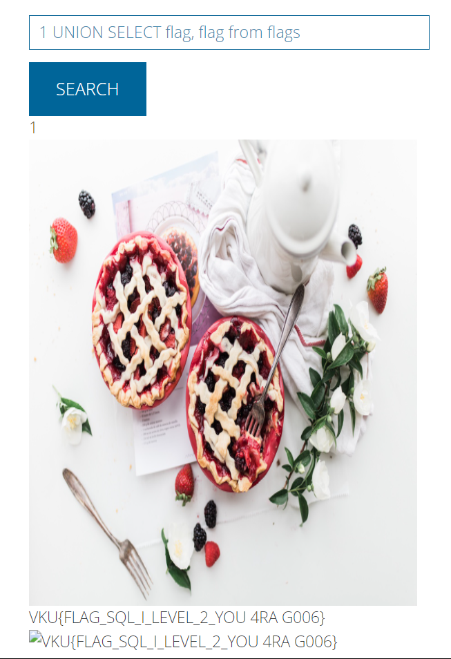

# Solve **SQL Injection Level 2**

Đối với bài này, lỗi SQL Injection sẽ xuất hiện ở phần Search Product.
Khi bạn nhập các số 1-14 thì trang web sẽ lần lượt trả về các hình ảnh sản phẩm tương ứng với giá trị ID mà bạn nhập.

Tiến hành dò cột để thực hiện lệnh UNION

(Điều kiện để dùng câu lệnh UNION:

- Số lượng cột của các lệnh SELECT phải bằng nhau
- Cùng kiểu dữ liệu.

)
Sử dụng `1 UNION SELECT NULL, NULL` thì dò được số column của câu select là 2.

Tiếp theo, dò tên bảng và tên cột. (Cái này bọn mình sẽ giới thiệu với các bạn sau)
Tuy nhiên, có hint tên bảng là: flags và tên cột là flag
Dùng payload: `1 UNION SELECT flag, flag from flags` sẽ lấy được flag.

`FLAG: VKU{FLAG_SQL_I_LEVEL_2_YOU 4RA G006}`
