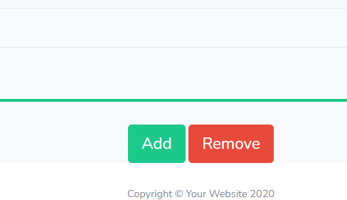
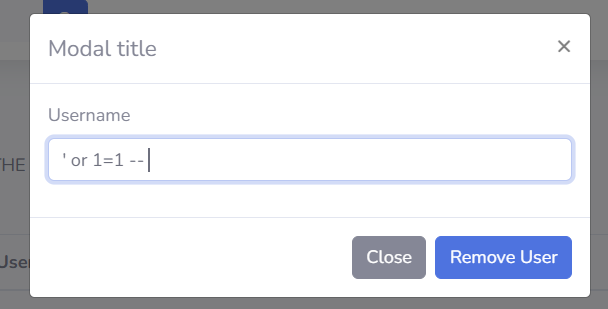
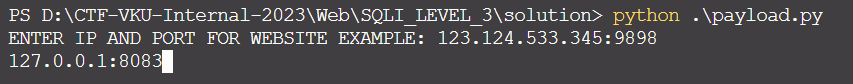
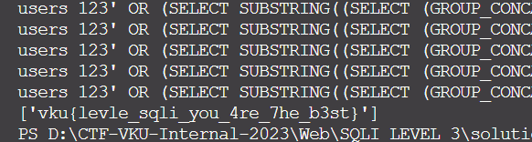

# Solve **SQL Injection Level 3**

Ở thử thách này, trên trang web có 2 tính năng có thể dính SQL Injection là ADD và DELETE

Khi kiểm tra thì chỉ có tính năng DELETE sẽ dính lỗi SQLi.
Dùng payload `' or 1=1 -- ` để kiểm tra. Nhập giá trị này vào username cần xóa.
Sau khi Remove User bằng Username trên thì toàn bộ user đều bị xóa.

Từ đây, có thể tận dụng lỗ hổng này để tìm ra tên các bảng và các cột có trong Cơ sở dữ liệu.

Mình đã viết một payload để giải bài này.
(Bạn cũng có thể tìm thấy payload này được public trên github thông qua gợi ý trên file **github.html**)

Xem và tải nó ở đây: [payload.py](./payload.py)
Chạy nó và bạn sẽ lấy được flag:

Chi tiết cách nó hoạt động, bọn mình sẽ giải thích vào những buổi training sau.

`FLAG: vku{levle_sqli_you_4re_7he_b3st}`
